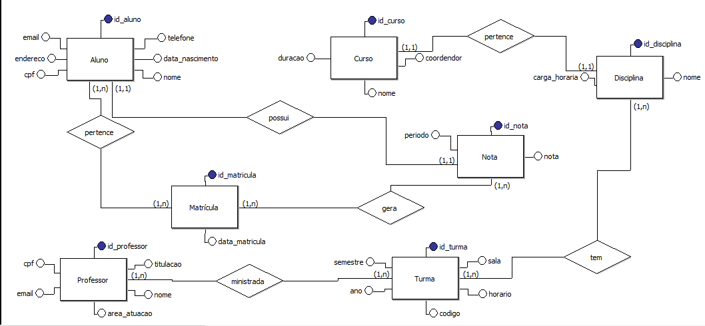
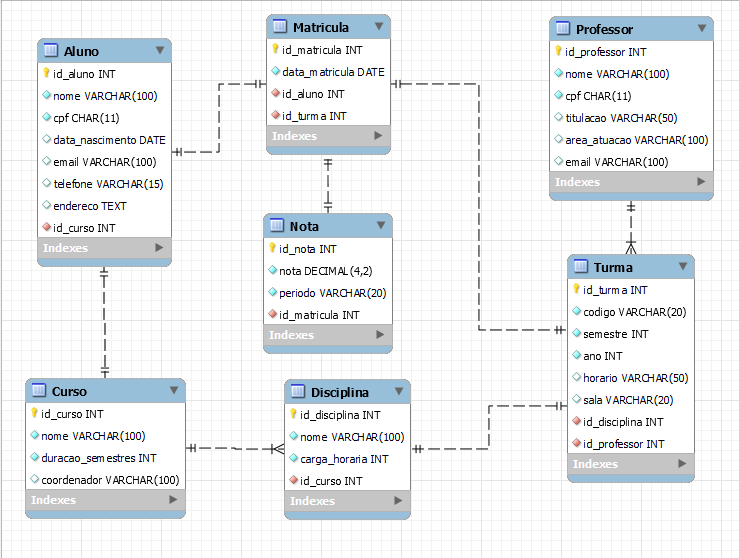

# 🎓 Sistema de Banco de Dados para Faculdade UNIFECAF - 

Este projeto foi desenvolvido como parte da disciplina de Banco de Dados no curso de Análise e Desenvolvimento de Sistemas da UniFECAF. Ele consiste na modelagem e criação de um sistema de banco de dados relacional para uma faculdade fictícia.

## 🧠 Objetivo

Criar um banco de dados capaz de armazenar informações sobre:

- Alunos
- Professores
- Cursos
- Disciplinas
- Turmas
- Matrículas
- Notas

O sistema permite controlar turmas, registrar matrículas e armazenar as notas dos alunos de forma estruturada e segura.

---

## 🛠️ Tecnologias utilizadas

- **MySQL** (Workbench e Server)
- **Modelo Conceitual e Lógico**: desenhado com ferramentas visuais de modelagem
- **SQL**: para criação e inserção de dados

---

## 📁 Estrutura do Projeto

/sql
└── modelo físico portfólio

/imagens
├── modelo_conceitual.png
└── modelo_logico.png

/pdf
└── Portifólio - Lohan.pdf

---

## 🗂️ Modelos

### Modelo Conceitual

### Modelo Lógico

---

## 💾 Execução

1. crie  o banco com o script em `/sql/modelo_fisico.sql`
2. Execute os comandos no MySQL Workbench
3. Os dados iniciais já estão populados nas tabelas

---

## 🎬 Vídeo Explicativo

Confira a explicação completa no vídeo abaixo:  
🔗 [Inserir link do YouTube ou LinkedIn]

---

## 📚 Autor

**Lohan Lucas da Silva Lima**  
Aluno do Centro Universitário UniFECAF - EAD  
Disciplina: Banco de Dados  
Tutor: Fernando Leonid

